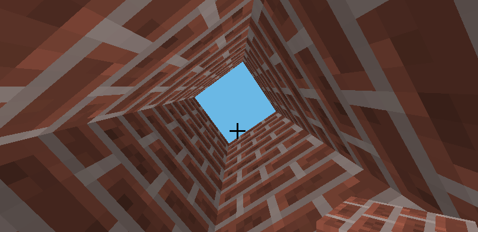

# Minecraft Programming

## Resources

* Introduction to the Minecraft Python API: http://www.stuffaboutcode.com/2013/04/minecraft-pi-edition-api-tutorial.html
* API reference: http://www.stuffaboutcode.com/p/minecraft-api-reference.html

## The Fence

*Objective:* Use if conditions to detect on what side of a fence one is. Reinforcement of coordinates from Intro.

File -> New -> Save: simple_fence.py

* Go to a flat area.
* Build a small fence (as shown on the screenshot) along the *x* axis, that is *z* should not change along the wall.
* Step on the fence, and walk along it, to determine its orientation. *y* will not change.
* Once you know what coordinate you built it along, you're ready to write the code.

```python
import mcpi.minecraft as minecraft
import time
mc = minecraft.Minecraft.create()

while True:
    time.sleep(1)
    pos = mc.player.getTilePos()
    if pos.z < z:    # what's the fence z coordinate?
        print("North of the fence.")
    elif pos.z > z:  # what's the fence z coordinate?
        print("South of the fence.")
    else:
        print("On the fence.")
```

:bulb: Do you want to print to the Shell or to Minecraft chat?


## The Cross

*Objective:* Use embedded if conditions and creative string concatenation

* Enhance your fence to look like a cross, like in the screenshot
* Figure out where the midpoint is, that is the *x* and *z* coordinates.
* You're ready to write the code.

File -> New -> Save: cross.py

```python
import mcpi.minecraft as minecraft
import time
mc = minecraft.Minecraft.create()

while True:
    time.sleep(1)
    pos = mc.player.getTilePos()
    if pos.z operator z:      # use the required operator
        north_south = "North"
        if pos.x operator x:  # use the required operator
            print(north_south + " West")
        else:
            print(north_south + " East")
    elif pos.z operator z:    # use the required operator
        north_south = "South"
        if pos.x operator x:  # use the required operator
            print(north_south + " West")
        else:
            print(north_south + " East")
    else:
        print()  # where am I now?
```

* Explain string concatenation again.
* Explain greater or equal versus greater.


## The Bulldozer

*Objective:* Work with more embedded loops and relative coordinates.

* This program lets you clear a large area and leave it suitable for building.
* In minecraft, an empty space is a block of type *AIR*

File -> New -> Save: cross.py

```python
import mcpi.minecraft as minecraft
import mcpi.block as block
mc = minecraft.Minecraft.create()

pos = mc.player.getTilePos()
for :  # three loops for a 20x20x20 cube
    for :
        for :
            mc.setBlock(pos.x + x, pos.y + y, pos.z + z, block.AIR.id)
```

- Where is the space relative to your position?
- Can you clear the space with yourself in the center? Hint: coordinates go from -10 to +10 relative to you.
- Are you digging down underground? How can you bulldoze 'above ground' (relative to where you are standing) or down but where y is greater than zero (don't go below sea-level)?
- :bulb: Write a function that takes (x, z) coordinates and bulldozes above sea-level with (x, z) at the center -- now you will have a bulldozer you can easily use in your other programs (basically everytime you build something, you can bulldoze first).

```python
def bulldoze(position_x, position_y):
    # blah blah blah
    
bulldoze(pos.x, pos.y)
```


## Anarkali

Anarkali (Pomegranate Blossom) lived in 17th Century India. She fell in love with the Prince and the King built a wall around her to keep her and the Prince apart.

*Objective:* Build four walls around your player when she steps onto the trap (and eventually help her escape).



:bulb: Before you start, you might want to sketch it out with pencil and paper. What range of coordinates will your walls cover?

File -> New -> Save: anarkali.py

```python
import time
import mcpi.minecraft as minecraft
import mcpi.block as block
mc = minecraft.Minecraft.create()

def buildWalls(x, y, z):
    brick = block.BRICK_BLOCK.id
    mc.setBlock(x-1, y, z-1, brick)
    mc.setBlock(x, y, z-1, brick)
    mc.setBlock(x+1, y, z-1, brick)
    # Build the other 3 walls

while True:
    time.sleep(1)  # check every second
    x, y, z = mc.player.getTilePos()
    if : # player on trap position
        buildWalls(x, y, z) # how many times do you need to build up (increase y)?
        break  # end whlile loop (so we don't keep rebuilding the walls)
```

:bulb: While you experiment, you may need to keep changing your trap position to build a new structure in a different place.

Make sure your walls are high enough to Anarkali can't jump out!

:bulb: Though it's fun to watch the blocks line up, there are faster ways to build structures. Rather than looping and setting a single block at a time, we can set a range of blocks together:

```python
# build a 3x3 cube (using start and end coordinates)
mc.setBlocks(x-1, y-1, z-1, x+1, y+1, z+1, block.BRICK_BLOCK.id) # where should y start and end?
```

:bulb: You can use the same trick for the bulldozer program you wrote earlier. In fact you should be bulldozing everytime you experiment with your tower contruction!

But we don't need a solid cube. Set AIR blocks to hollow the inside.

```python
mc.setBlocks(x, y, z, x, y+1, z, block.BRICK_BLOCK.id) # how high does y need to go?
```

You can also build a higher or thicker structure (to prevent escape). 

The King's heart softens and he allows the Prince to rescue Anarkali. The Prince sets a special timer that catapults Anarkali out of the walls and lands outside.
You can set player position to help Anarkali escape. Use 'time' to wait (3 seconds) before the escape.

```python
mc.player.setPos(x+10, y+10, z+10)  # move player to a new position, and watch her fall to earth
```

:trophy: Challenge: What if Anarkali was born in Eygpt not India? Would the king build a tower, or... a Pyramid!

:trophy: Challenge: What else would you put around the tower / pyramid to prevent escape? A moat of water. Lava perhaps? Try a single block of WATER or LAVA (it flows!).


## Build a House

*Objective:* Build a house using the skills learned

- Remember the house you built earlier? Let's try building the same using programming.

File -> New -> Save: house.py

- First build a solid cuboid. Do you want to build it where you're standing (and get trapped inside), or some distance away from you?
- :idea: bulldoze some space for your house before your start building. 


- Then clear the inside of the cuboid (your walls should be 1 block thick). That is, place an AIR cuboid inside your solid cuboid.
- Once the cube is built, you can break up a few blocks to convince yourself that it is indeed hollow.


- Understand why we have the +1 / -1 (depends which side of the house your hollowing).
- Understand why the y dimension is special: because we don't need to hollow out the ground floor (did you?)

- :laughing: For fun: 
  - Go in and place some torches.
  - Place a few windows using the glass block.
  - Place some ladders on the outside to allow easy climbing to the roof.
  - Put in some furniture, a bed, a stove, a door. Perhaps trees and flowers outside.
  - Would a pool be nice? 
  - How about carpeting? (remember WOOL -- use colors for patterns).
  - Perhaps it's not a house, but a castle! Build a tower on each corner. And a moat around.

- :trophy: Personalize your house!
  - Place the house construction code inside a function, taking house dimensions as parameters. Because your're not just building your house, but a whole town!

```python
def build_house(width, depth, height):
    # super awesome building code goes here
```


## The Tunnel

*Objective:* Introduce loops with interval and modulo

- We will dig a tunnel through a mountain and light it up with torches every 3 blocks.
- This is complicated enough that you will want to sketch it out on a piece of paper first, particular the concept of direction (which direction does your tunnel go?).
- Can't find a mountain? You know how to build a BIG solid block of rock! We can tunnel through that.

File -> New -> Save: tunnel.py

- Write a function that takes the length and direction of your tunnel, and builds a tunnel from where you are standing.
- Use 'raw_input' to get input from the keyboard.

```python
import mcpi.minecraft as minecraft
import mcpi.block as block
import time
mc = minecraft.Minecraft.create()

def build_tunnel(length, direction):
    print("building a tunnel of length: " + str(length) + " direction: " + str(direction))
    pos = mc.player.getTilePos()

    start_x = pos.x
    start_y = pos.y
    start_z = pos.z

    # setup defaults, which will be changed as needed
    end_x = start_x
    end_y = start_y + height # how high should your tunnel be? 2 blocks?
    end_z = start_z

    if direction == 1:
        end_x = # depends on length and direction
    elif direction == 2:
        end_x = # depends on length and direction
    elif direction == 3:
        end_z = # depends on length and direction
    elif direction == 4:
        end_z = # depends on length and direction

    # dig the tunnel
    mc.setBlocks(start_x, start_y, start_z,
                 end_x,   end_y,   end_z,
                 block.AIR.id)

length = int(raw_input("length of tunnel?"))
direction = int(raw_input("direction?"))

build_tunnel(length, direction)
```


- Now let's add some torchers at regular intervals

```python
# how does range work?
for i in range(0,20):
    print i

step = 3
for i in range(0, 20, step)
    print i
```

- Torches will be need to be placed in the same direction as the tunnel

```python
    torch_x = start_x
    torch_y = # above ground, depends on how high the tunnel is
    torch_z = start_z
    
    for i in range(0, length, 3):
    
        if direction == 1:
            # change torch_x or torch_z depending on direction
        elif direction == 2:
            # change torch_x or torch_z depending on direction
        elif direction == 3:
            # change torch_x or torch_z depending on direction
        elif direction == 4:
            # change torch_x or torch_z depending on direction

        print("placing torch: ", torch_x, torch_y, torch_z)
        mc.setBlock(torch_x, torch_y, torch_z, block.TORCH.id, 1)
```

- :trophy: Put torches on both sides of the tunnel, using spaced intervals.
- :trophy: Build a tunnel which digs a few blocks under the ground, and places a staircase for easy access on both ends
