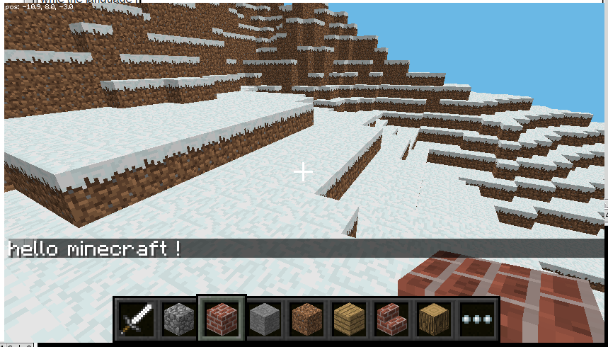

# Minecraft Programming using Python and Raspberry Pi

- Lesson plan is based on a 10am - 4pm day (including snack breaks!)
- Students will be a parent-child pair

### General Introductions (15 mins: 10am - 10:15am)

### Wooden Block Game (15 mins: 10:15am - 10:30am)

- Building Instructions: 
  - B (Block) *x, y, z*
  - B (Block) *(start-end) (start-end) (start-end)* 

- :trophy: Human Programmer Computer Challenges:
  - 4x3 wall
  - 3x3 cube
  - 8x pyramid
  - fort

### Setup Raspberry Pi (15 mins: 10:30am - 10:45am)
- Video: What is a Raspberry?
- Pi board
- SD Card (pre-setup)
- HDMI (display) cable
- Wifi
- Keyboard
- Mouse
- Power

### Introduction to Minecraft (30 mins: 10:45am - 11:15am)
  - What is Minecraft?
    - [What is Minecraft all about?](http://minemum.com/what-is-minecraft)
  - What is Minecraft Pi? (features and limitations)
    - [Pi Edition](http://minecraft.gamepedia.com/Pi_Edition)
  - Play the game!
    - Menu -> Minecraft
    - Start Game -> Create New (you can create new worlds till you get one you like)
  - Keys:
  
    Key | Action 
    --- | ------
    W	| Forward
    A	| Left 
    S	| Backward 
    D	|	Right
    Left-click | Hit
    Right-click | Place block
    Mouse-scroll | Hotbar select
    E	|	Inventory
    Space	|	Jump / Fly up
    Left Shift | Crouch / Fly down
    Double Space	|	Fly / Fall
    Esc	| Pause / Game menu
    Tab	| Release mouse cursor

- Minecraft coordinate system:
  - x-axis: East (positive), West (negative)
  - z-axis: South (positive), North (negative)
  - y-axis: High (positive), Low (negative)
  - Right-handed coordinates: thumb = x, index = y, middle = z
  

  - :trophy: Challenges
    - Move to position 0,0,0
    - Learn to fly and swim
    - What is the (y) coordinate of sea-level?
    - How big (x, z) is your world?
    - Can you find the South East corner of your world?
    - Build a house with stone walls, door, windows and wooden roof (bonus: fence around the house)
    - What are the dimensions (x, y, z) of your house?

### Introduction to Python (45 mins: 11:15am - 12:00pm)
- Why Python?
  - [A great first programming language](http://readwrite.com/2014/07/08/what-makes-python-easy-to-learn/)
  - [Python RefCard](https://dzone.com/refcardz/core-python)
- Video: Pair Programming (from code.org)
- [Jupyter Notebook](notebook/)

### Lunch Break (45 mins: 12:00pm - 12:45pm)
- Minecraft Bingo

### Minecraft Programming (90 mins: 12:45pm - 2:15pm)
- [Jupyter Notebook](notebook/)

### Electronics (90 mins 2:15pm - 3:45pm)
- [Jupyter Notebook](notebook/)
